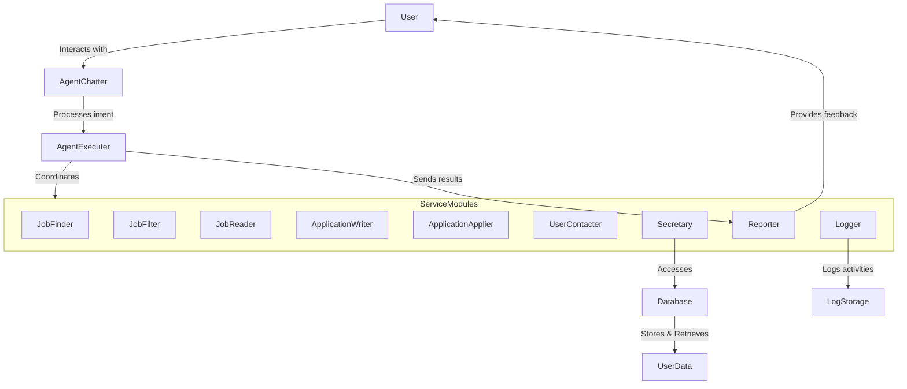

**Disclaimer**:
This project is for personal use and not for commercial. Also, due to gray area of job scraping on job sites(e.g. linkedin, seek and etc.) This project will not be hosted online for public usage. 
A demo video and a way to deploy locally may provided in the later stage.

# Table of content
- System Design
    - [High level view](https://github.com/jimmyzhangyl/?tab=readme-ov-file#system-design-for-job-ad-collection-and-resume-matching-service)
    - [Tech Stacks](https://github.com/jimmyzhangyl/?tab=readme-ov-file#tech-stack)

# System Design for Job Ad Collection and Resume Matching Service

## Overview

This document outlines the system design for a service that collects job ads, filters them based on user requirements, and generates personalized resumes and cover letters for job applications.

## Architecture Diagram


```plaintext
+-------------------------------------+
|               User                  |
+-------------------------------------+
                |
                v
+-------------------------------------+
|            AgentChatter             |  <-- (Analyze user intention, free user from commands)
+-------------------------------------+
                |
                v
+-------------------------------------+
|           AgentExecuter             |  <-- (Central processor for executing services)
+-------------------------------------+
                |
                +---------------------------------------------+
                |                                             |
    +-----------------------+               +-----------------------+
    |    JobFinder           |               |    JobFilter          |
    |  (Search jobs on sites)|               |  (Filter based on     |
    |                        |               |  user preferences)    |
    +-----------------------+               +-----------------------+
                |                                             |
                v                                             v
    +-----------------------+               +-----------------------+
    |    JobReader           |               |    ApplicationWriter   |
    |  (Collect & clean data)|               |  (Compose Resume & CV) |
    +-----------------------+               +-----------------------+
                |                                             |
                v                                             v
    +-----------------------+               +-----------------------+
    |    ApplicationApplier  |               |    UserContacter       |
    |  (Submit jobs & answer |               |  (Request additional   |
    |   questions)           |               |   information)         |
    +-----------------------+               +-----------------------+
                |
                v
    +-----------------------+               +-----------------------+
    |    Logger              |               |    Reporter            |
    |  (Log system activities|               |  (Send service results |
    |   & track actions)     |               |   to user)             |
    +-----------------------+               +-----------------------+

                v
    +----------------------------------------------------------+
    |                    Secretary (Gateway to DB)             |
    +----------------------------------------------------------+
                                  |
                                  v
    +-------------------------------------------------------------------+
    | Database                                                         |
    +-------------------------------------------------------------------+
    |                                                                   |
    |  +-------------------+    +-------------------+    +------------+ |
    |  | Background         |    | BasicInfo         |    | JobTargets | |
    |  | +Education         |    | +Username         |    | +Location  | |
    |  | +Experience        |    | +Password         |    | +Title     | |
    |  | +Skills            |    | +Address          |    | +Skills    | |
    |  | +ShowCases         |    | +Email            |    | +Experience| |
    |  | +Objective         |    | +Mobile           |    | +Company   | |
    |  |                    |    | +Name             |    | +WorkType  | |
    |  |                    |    | +Social Media     |    | +Salary    | |
    |  +-------------------+    +-------------------+    +------------+ |
    |                                                                   |
    +-------------------------------------------------------------------+
```

## Components

### User Interaction Layer

#### User

-   **Description**: The individual interacting with the system.

#### AgentChatter

-   **Description**: Analyzes the user's intent and serves as a conversational interface.
-   **Features**:
    -   Natural Language Processing (NLP) for intent recognition.
    -   Handles user queries and commands.

#### AgentExecuter

-   **Description**: Central processor executing services as instructed by AgentChatter.
-   **Features**:
    -   Orchestrates service modules.
    -   Manages workflow execution.

### Core Service Modules

#### JobFinder

-   **Description**: Searches for job listings on different websites.
-   **Features**:
    -   Web scraping and API integration.
    -   Compliance with site terms of service.

#### JobFilter

-   **Description**: Filters job listings based on user preferences.
-   **Features**:
    -   Dynamic filtering criteria.
    -   Optimized for performance.

#### JobReader

-   **Description**: Collects and cleans job data for processing.
-   **Features**:
    -   Data validation and normalization.
    -   NLP for key information extraction.

#### ApplicationWriter

-   **Description**: Composes resumes and cover letters.
-   **Features**:
    -   Integration with Language Models (e.g., GPT-3.5).
    -   Customizable templates.

#### ApplicationApplier

-   **Description**: Submits job applications and answers additional questions.
-   **Features**:
    -   Automates application submission.
    -   Handles variable application processes.

#### UserContacter

-   **Description**: Requests additional information from the user when necessary.
-   **Features**:
    -   Real-time communication.
    -   Secure information handling.

#### Logger

-   **Description**: Logs system activities.
-   **Features**:
    -   Centralized logging system.
    -   Activity tracking and error logging.

#### Reporter

-   **Description**: Sends service results back to the user.
-   **Features**:
    -   Notification system.
    -   Real-time updates.

#### Secretary

-   **Description**: Gateway to the database, managing user data.
-   **Features**:
    -   Data access abstraction.
    -   Secure database interactions.

### Data Storage and Management

#### Background

-   **Description**: User’s education, experience, skills, projects, and career objectives.

#### BasicInfo

-   **Description**: Personal details such as username, password, address, email, mobile number, name, and social media links.

#### JobTargets

-   **Description**: User’s job preferences, including location, job title, desired skills, experience level, company preferences, work type, salary expectations, and certifications.

#### JobLogs

-   **Description**: Logs details of applied jobs.

## Workflow

1.  **User Interaction**: The user engages with the system via **AgentChatter** using natural language or commands.
    
2.  **Intent Processing**: **AgentChatter** processes the user's intent and communicates with **AgentExecuter**.
    
3.  **Service Execution**: **AgentExecuter** coordinates with service modules like **JobFinder** and **ApplicationWriter** to perform tasks.
    
4.  **Data Interaction**: Service modules interact with the database via **Secretary** to retrieve or update user data.
    
5.  **User Feedback**: **Reporter** provides feedback to the user on the completed tasks.
    
6.  **Activity Logging**: **Logger** records all activities for tracking and debugging purposes.
    

## Additional Recommendations

### Technology Stack

-   **Programming Language**: Python
-   **Web Framework**: FastAPI for backend APIs
-   **Frontend Framework**: React or Vue.js for responsive UI
-   **Databases**:
    -   PostgreSQL for structured data
    -   MongoDB for unstructured data (if needed)
-   **Message Broker**: RabbitMQ or Redis for asynchronous task queues

### Scalability and Performance

-   Implement microservices architecture for independent scaling.
-   Use load balancers and caching mechanisms (e.g., Redis).
-   Plan for high availability and disaster recovery.

### Security Measures

-   Use OAuth 2.0 for authentication.
-   Implement role-based access controls.
-   Enforce HTTPS and encrypt sensitive data.

### Compliance and Ethical Considerations

-   Obtain user consent for data processing.
-   Ensure compliance with GDPR and other data protection regulations.
-   Be cautious with automating job applications to comply with platform policies.

### Logging and Monitoring

-   Use tools like Prometheus and Grafana for real-time monitoring.
-   Set up alerts for critical system failures.

### Continuous Integration and Deployment (CI/CD)

-   Use Git for version control.
-   Automate testing and deployment with CI/CD pipelines (e.g., Jenkins, GitHub Actions).
-   Implement unit, integration, and end-to-end testing.

### User Experience Enhancements

-   Personalize job recommendations using machine learning.
-   Provide users with options to adjust their preferences easily.
-   Ensure the platform is accessible to users with disabilities.

## Next Steps

1.  **Detailed Planning**: Break down each module into smaller tasks and define interfaces.
    
2.  **Prototype Development**: Develop a minimum viable product (MVP) focusing on core features.
    
3.  **Team Collaboration**: Assign roles and set up regular progress meetings.
    
4.  **Technology Evaluation**: Experiment with different tools to find the best fit.
    
5.  **Risk Assessment**: Identify potential risks and develop mitigation strategies.
    


# Tech Stack

## Language: Python
Simple and quick development. And also better support to intergrate with LLM. 
## Framework: FastAPI
FastAPI endpoint -> pydantic -> database paradigm
It has advantage of auto generated API documentation
## DB:
## Testing Framework: pytest
## CI/CD: Github action
## Scraping Tool: Selenium with ChromeDriver
## Coding Style: Pre-Commit Hooks + Black + Flake8
